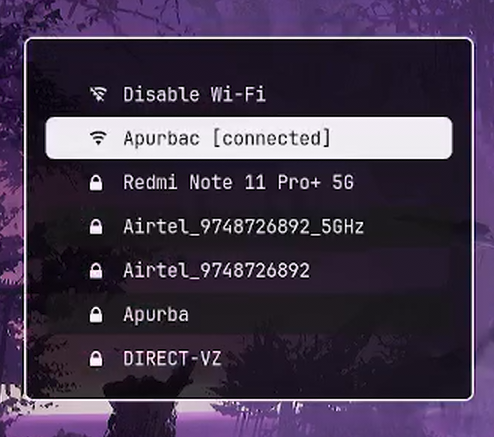

# Rofi Wi-Fi Menu 

A simple Wi-Fi menu script that uses [rofi](https://github.com/davatorium/rofi) and [nmcli](https://gitlab.freedesktop.org/NetworkManager/NetworkManager).



## What can this script do ?

- Enable or Disable Wi-Fi
- Display available Wi-Fi SSIDs along with their access level
- Connect to any Wi-Fi from their SSID with either their saved password or prompt for password
- Notify the success or failure message


### Installation

Install [rofi](https://github.com/davatorium/rofi) [nmcli](https://gitlab.freedesktop.org/NetworkManager/NetworkManager) and [dunst](https://github.com/dunst-project/dunst) using either your package manager or clone the repo and install accordingly and set any [Nerd Font](https://www.nerdfonts.com/font-downloads) in your Rofi config to be able to use all the icons. Then run these commands.

```
git clone https://github.com/ZuxRoy/wifi-rofi.git
cd wifi-rofi
./rofi-wifi-menu.sh
```

The icons used in the `dunst` notifications are present in the `icons` folder. To use them follow these steps.

```
mkdir -p ~/.local/share/icons/custom
cp icons/* ~/.local/share/icons/custom/
```

The example config has also been added in this repo. The font used in this config is the JetBrainsMono Nerd Font, download to use. To use this config follow these steps.

```
mkdir -p ~/.config/rofi/
cp theme.rasi ~/.config/rofi/config.rasi
```

### Troubleshooting 

PopOS! does not have the notify-send library installed by default. You can install it with the following command 
  
  ```bash
  sudo apt install libnotify-bin
  ```


